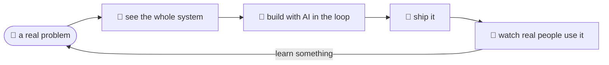

<p align="center">
  
</p>

For years my whole world was the thing in your hand. Flutter, Swift, Kotlin, mostly fintech, where a rounding error ruins someone's day and *"works on my machine"* has never saved anybody. Then I kept following bugs past the screen, and the map got bigger.

<p align="center">
  
</p>

Which is how I ended up building a whole product on my own. You know that moment at an owambe, a concert or a packed market where your friends are *"somewhere here"* and the phone just keeps ringing out? PinDey fixes that. Open it, tap a friend, and an arrow points you straight to them, telling you warmer or colder as you walk.

<p align="center">
  <a href="https://pindey.app"></a>
</p>

AI is part of how I work every day. Not as a party trick, more like a very fast pair who never gets tired of my questions. It's why one engineer can carry what used to take a small team, and it pushes the real craft up a level. Here's the loop:



And right now, on any given day:

```console
donald@earth:~$ whoami
product engineer · mobile at heart · AI in the loop

donald@earth:~$ ps
PROCESS          STATUS
day-job          running
pindey           running   # in prod. go look.
side-projects    running   # some may never see daylight
writing          running   # poetry, prose, long thoughts on software
```

A few things I've left lying around on pub.dev:

| | |
|:--:|:--|
| 🧰 | **[flutter_skill_gen](https://pub.dev/packages/flutter_skill_gen)** writes `SKILL.md` files for AI assistants, because good tooling should teach the robots too. |
| 🖼️ | **[multi_image_layout](https://pub.dev/packages/multi_image_layout)** lays out image grids so you never do that maths by hand again. |

<details>
<summary><b>📖 Got five minutes? The long version.</b></summary>
<br/>

I started out building the part of software you hold in your hand. For years that was the whole world: Flutter, Swift, Kotlin, a release train, and a phone somewhere with two bars of signal that the app still had to feel fast on. Most of those years were in fintech. I still love that work. I still think the empty states and the offline path are where you find out who really cared.

Somewhere along the way the job got bigger than the screen. I kept following the bug past the API call, then past the server, then into the database and the queue and the cron job nobody remembered writing, and at some point I looked up and realised I wasn't really a mobile engineer anymore. I was just an engineer who happened to know mobile very well, the kind who sits with a problem until the whole system around it comes into view, and then builds whatever that system needs, on whatever layer it lives.

That is how PinDey happened. It started with a very Lagos problem: you're at a party, your people are "by the bar", and there are five bars. A pin on a map is tens of metres off and doesn't tell you which way to walk, so PinDey gives you an arrow, a distance, and the old warmer or colder game, with haptics that speed up as you close in. My favourite decision in the whole thing is that the Finder is honest. When the phone genuinely can't tell which way to point, it says *"very close, look around"* instead of confidently sending you the wrong way. The privacy side got the same care: there's no location history, positions disappear about two minutes after the last update, and nothing gets sold.

It is mine from end to end, the app, the backend, the infrastructure, the decisions nobody sees and the ones everybody does. Building it taught me more about product than any title ever did, mostly because when you own every layer there's nobody to hand the hard part to. Honestly, that's the fun bit.

I build with AI the way I used to build with a good IDE, except the conversation goes both ways now. It sits in how I sketch architectures, how I read unfamiliar code, how I ship. The craft moves up a level, toward understanding the problem properly, choosing the right shape for the system, and knowing which parts deserve your own hands. That's the part I find fun, and I'm leaning all the way into it.

When I'm not doing that, I'm writing. It turns out finding the right word and finding the right abstraction are pretty much the same muscle.

</details>

<br/>

<p align="center">
  <a href="https://donaldamadi.dev"></a>
  <a href="https://pindey.app"></a>
  <a href="https://www.linkedin.com/in/donald-amadi-7b95b817a/"></a>
  <a href="mailto:donaldamadi15@gmail.com"></a>
</p>

<p align="center"><i>Think about the problem, see the system, build the thing. Then make it quiet.</i></p>
